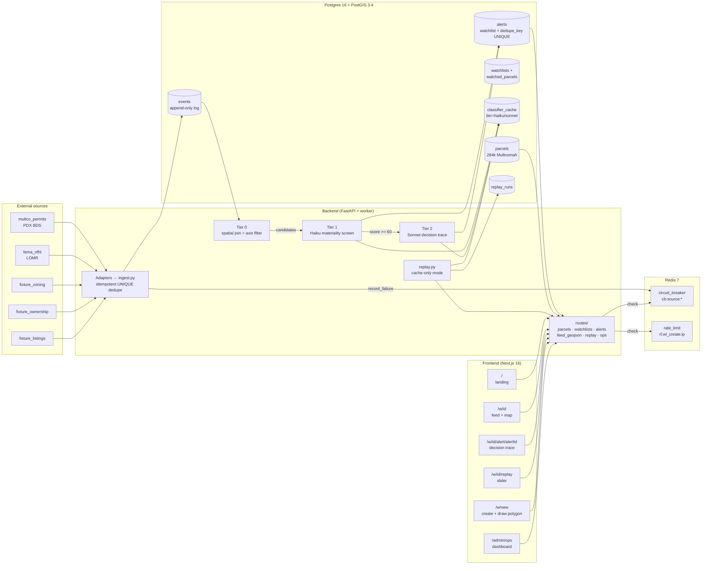
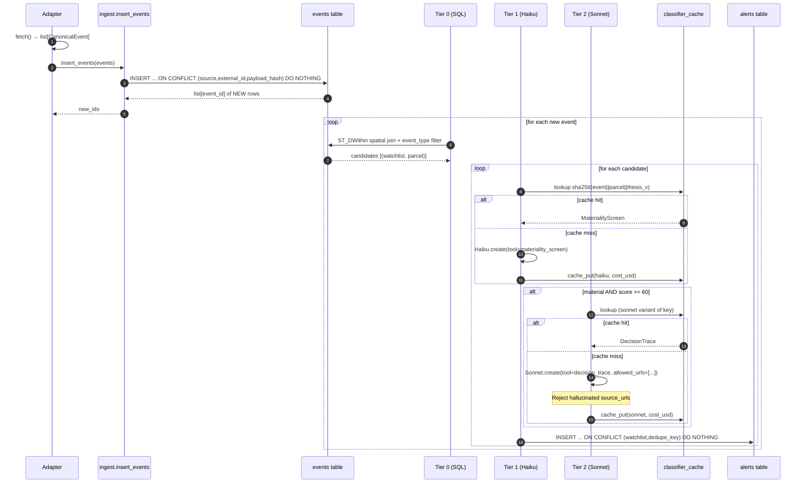
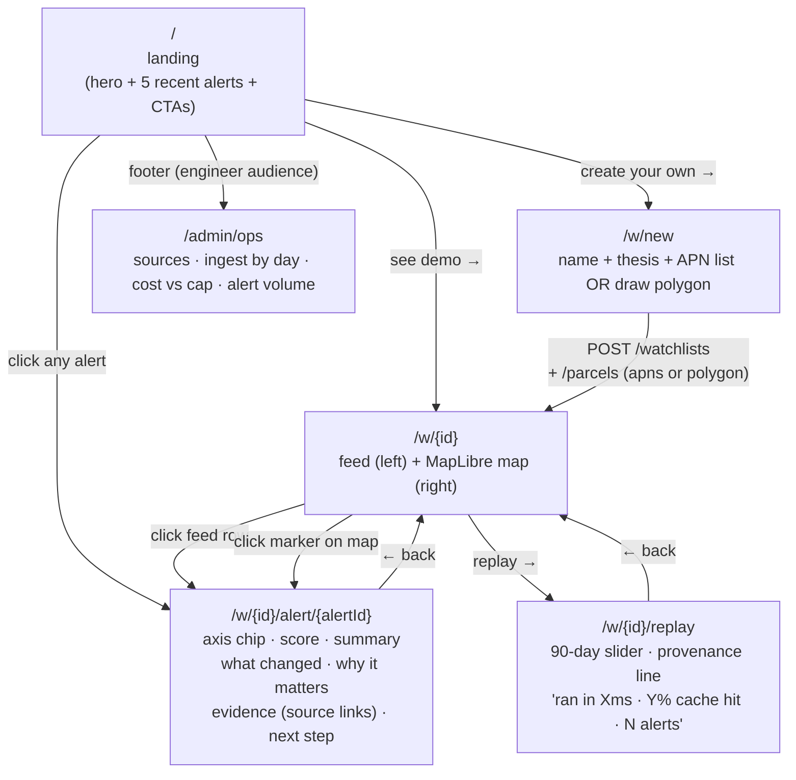

# ParcelPulse

Event-sourced change feed and decision-alert engine for parcel watchlists. Land
acquisition teams at homebuilders track hundreds of parcels at once. Permits,
zoning, ownership, FEMA flood maps, and listings all change quietly across
3,000+ counties — by the time a deal slips, the signal was usually sitting in
some county portal nobody was watching. ParcelPulse pulls those signals,
spatially attributes them to watched parcels, runs a tiered LLM materiality
screen against the user's deal thesis, and surfaces ranked, evidenced
"act on this" alerts.

Two audiences in one product:

- **Land acquisition lead** → ranked feed of changes on watched parcels → click any alert for a structured decision trace (what changed, why it matters to the thesis, evidence with source links, suggested next step + urgency)
- **Engineer / oncall** → `/admin/ops` shows per-source ingestion lag, daily LLM spend vs cap, alert volume by axis — proves the system isn't theatre

## Architecture



## Request flow

How one event becomes (or doesn't become) an alert. Every step is independently testable; LLM calls are cached so re-runs are deterministic.



## UI flow

Visitor's path through the product. Every page is a server component except the map, replay slider, polygon-draw, and ops dashboard (which need browser APIs).



## Patterns

| Pattern | File | What it solves |
| --- | --- | --- |
| Append-only event log + projections | `api/src/parcelpulse/models.py`, `ingest.py` | Replay determinism; same input → same output years later |
| Two-layer dedupe (event + alert) | `events.UNIQUE(source,external_id,payload_hash)`, `alerts.UNIQUE(watchlist_id,dedupe_key)` | Source noise (same record 3×) and cross-source duplicates both collapse |
| Tiered classifier (Tier 0 → 1 → 2) | `materiality/tier0.py`, `tier1.py`, `tier2.py`, `classify.py` | ~70% rejected free at Tier 0; only high-score alerts pay for Sonnet |
| Cache-keyed replay determinism | `materiality/tier1.py:cache_key`, `tier2.py:cache_key`, `replay.py` | Slider re-fetch is free, free, and the same — no live LLM during replay |
| Closed-set evidence URLs | `materiality/tier2.py:build_allowed_urls` | Sonnet picks `source_url` from a list it's given; hallucinated links are rejected pre-cache |
| Idempotent bulk ingest | `ingest.py:_INSERT_SQL` (`jsonb_to_recordset` + `ON CONFLICT DO NOTHING`) | Same upstream pull twice → zero duplicates, no per-row roundtrips |
| Daily LLM cost cap | `materiality/classify.py:daily_cost_so_far` | Hard $5/day ceiling; over-budget candidates skip until tomorrow, never surprise-bill |
| Per-source circuit breaker | `circuit_breaker.py` (Redis) | 3 failures in 5min → pause source for 15min; surfaces in `/health` |
| Spatial pre-filter on hot path | `materiality/tier0.py` (`ST_DWithin` + `event_type = ANY(...)`) | LLM never sees events that geographically can't matter |
| Source adapter protocol | `adapters/base.py:SourceAdapter` | Adding a new source is one file (`adapters/x.py`) + one line in `registry.py` |
| Fixture-fallback adapters | `adapters/_fixture.py` + `adapters/fixture_*.py` | Real-data parity for axes whose public APIs don't exist; UI badges them honestly |
| Per-IP rate limit (Redis INCR + TTL) | `rate_limit.py` | 5 watchlists/IP/hour caps abuse without auth |
| Structured JSON logging | `observability.py` | `docker compose logs api \| jq` works; same shape as Logfire / Grafana |

## Tech stack

**Backend** (`api/`)

- Python 3.11+ · FastAPI 0.115 · SQLAlchemy 2 (async) · asyncpg 0.30
- Postgres 16 + PostGIS 3.4 · Alembic 1.14
- Redis 7 (Streams + circuit breaker + rate limit)
- Anthropic SDK 0.40 (Claude Haiku 4.5 + Sonnet 4.6, tool-use for structured output)
- APScheduler 3.10 · tenacity 9.0 · structlog 24.4 · GeoAlchemy2 0.16

**Frontend** (`web/`)

- Next.js 16 + React 19 + TypeScript · Tailwind 4
- MapLibre GL JS 5.24 + OpenFreeMap basemap (no API key)
- @mapbox/mapbox-gl-draw 1.5 (custom dashless styles for MapLibre 5 compat)
- @radix-ui/react-slider · recharts 3 · Anthropic-free (UI is purely a consumer)

**Infra** (`infra/`)

- Docker Compose: `postgis/postgis:16-3.4` + `redis:7-alpine`
- GitHub Actions: ruff + pytest (against postgres/redis service containers) + pnpm lint/build + docker build smoke

## Key trade-offs

Deliberate choices where the simpler option beats the orthodox one:

- **PostGIS over DuckDB-Spatial**. We need OLTP writes (event log, alerts) plus spatial joins on the hot path. PostGIS is the only mature option for both — DuckDB-Spatial is great analytical, weak for the write-heavy paths.
- **In-process classification over Redis Streams worker pool**. The architecture doc reserves Redis Streams for scale; in code we run the classifier inline after `insert_events` returns the new event ids. At Multnomah-county volume (~3k events/day) this is fine. Streams is a one-file change when we need it.
- **Cache key incorporates the tier**. `cache_key()` for Tier 1 vs `cache_key()` for Tier 2 produce different bytes for the same `(event, parcel, thesis_version)` so they coexist in `classifier_cache` (whose primary key is just `cache_key`). Tier 2 prefixes its hash with `b"sonnet:"`.
- **Replay reuses the current parcels projection, not bitemporal snapshots**. A 30-day-ago replay over today's parcel state is honest enough for a demo; bitemporal projections are a v2 stretch and called out in the README rather than silently faked.
- **Fixture adapters for the 3 axes whose real public APIs don't exist** (Portland zoning amendments, deed records, listings/comps). Each carries `source = "fixture_*"` so the UI can render a small "fixture" badge — the demo never claims fixture data is real. The `SourceAdapter` shape is identical to real adapters, so swapping a fixture for a real source is a one-file diff.
- **Anonymous workspace UUID for visitor-created watchlists**. Real multi-tenancy is out of scope; rate limit (5/IP/hour) is the only abuse gate. Clerk auth is a one-day add when needed.
- **Custom dashless MapboxDraw styles**. MapLibre v5 rejects unwrapped literal arrays in `line-dasharray`, breaking mapbox-gl-draw v1's defaults. Override is six small layer specs in `polygon-draw.tsx` rather than pinning MapLibre to v4 or switching draw libraries.

## Quickstart

```bash
# 1. Bring up Postgres+PostGIS and Redis
docker compose -f infra/docker-compose.yml up -d
# Postgres on host port 55432, Redis on 56379 (non-standard to avoid collisions
# with anything else you have running locally).

# 2. Install Python deps + run migrations
cd api
python3.13 -m venv .venv
.venv/bin/pip install -e ".[dev]"
.venv/bin/alembic upgrade head

# 3. Seed the local DB (one-shot scripts; idempotent)
.venv/bin/python scripts/load_parcels.py        # ~284k Multnomah parcels (~5min)
.venv/bin/python scripts/seed_watchlist.py      # demo watchlist + 10 watched parcels
.venv/bin/python scripts/seed_fixture_alerts.py # 5 plausible fixture alerts

# 4. Add ANTHROPIC_API_KEY to a local .env (gitignored). Tier 1+2 stay
# inactive without it; replay + UI work fine on the seeded fixture alerts.
echo "ANTHROPIC_API_KEY=sk-ant-..." > .env

# 5. Start the API (port 8000) and the scheduler (separate process, optional)
.venv/bin/uvicorn parcelpulse.main:app --port 8000 --app-dir src
.venv/bin/parcelpulse-scheduler   # in another terminal — pulls every 15min

# 6. Start the web (port 3000)
cd ../web
pnpm install
pnpm dev
```

Then open:

- http://localhost:3000 — landing
- http://localhost:3000/w/00000000-0000-0000-0000-000000000001 — demo watchlist
- http://localhost:3000/w/00000000-0000-0000-0000-000000000001/replay — replay slider
- http://localhost:3000/w/new — create your own
- http://localhost:3000/admin/ops — engineering dashboard

## Tests

```bash
cd api && .venv/bin/pytest -q
```

122 pytest cases. Some highlights:

- `test_smoke_end_to_end.py` — canonical CI gate: parcel → event → cached Tier 1 → alert lands within 60s
- `test_ingest.py` — same event ingested twice → 1 row, payload-changed → 2 rows
- `test_classify.py` — material screen writes alert; second run blocked by `(watchlist, dedupe_key)` UNIQUE; `score >= 60` triggers Tier 2; cost cap halts before API call
- `test_tier1.py` / `test_tier2.py` — cache hit skips API, `use_cache_only=True` returns None on miss, hallucinated evidence URLs rejected
- `test_replay.py` — same window twice → identical alerts; uncached candidates surface in `skipped_for_cache_miss`
- `test_circuit_breaker.py` — 3 failures inside the rolling window → pause; success between failures clears count, doesn't unpause mid-window
- `test_rate_limit.py` — 5 POST /watchlists per IP/hour, 6th → 429

CI runs the full suite against postgres+postgis + redis service containers in GitHub Actions.

## Deploy

The infra is sized for a single-region single-host deployment:

- **Backend (api + worker)** → Railway, two services on the same Dockerfile (`api/Dockerfile`), different start commands. Migrations as Railway release command before each deploy.
- **Frontend** → Vercel, Next.js 16 + Edge runtime. CORS allowlist on api locked to the prod web domain.
- **Database** → Neon Postgres with PostGIS extension (verify availability on chosen tier).
- **Cache + circuit breaker + rate limit** → Upstash Redis (Streams supported on the free tier).
- **Map tiles + asset storage** → Cloudflare R2; PMTiles slice of Multnomah uploaded once.
- **Cost ceiling** → daily LLM spend hard-capped at $5/day in `settings.daily_llm_cost_cap_usd`; the tiered-classifier dropoff (~$0.001/Haiku, ~$0.007/Sonnet) keeps real usage well under that.

---

Repo: https://github.com/krish1236/parcelpulse  *(planned name; currently private until Phase 11)*
